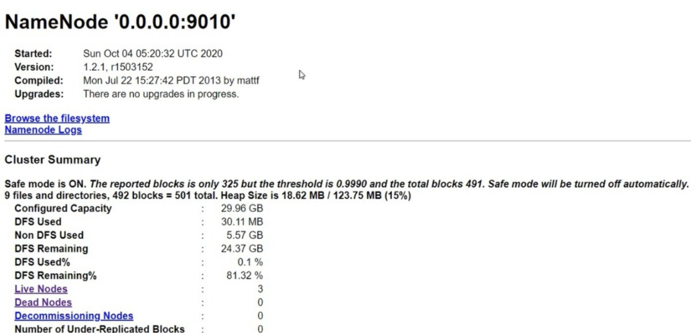

# Personalised database with speech recognition feature.
Live demo : https://www.youtube.com/watch?v=uj0YORgu-bs&t=2s

AIM: 
To create a personal database using hadoop cluster with capacity of terabytes to store data and share it with team.

TOOLS REQUIRED:
	1. Linux OS
	2. AWS (E2 instances)
	3. JDK
	4. Hadoop
	5. Python
	6. PCs(minimum one)

IDEA:
	*Hadoop master-slave cluster to increase storage and enhance speed of operation.
	*Enable SECURITY by editing the Security group of AWS instance (This will allow only specific systems to join the cluster).
	*Read-only mode to make the client's data safe. (No one can delete or edit anyone else's file)
	*Speech recognition feature to see the report of the cluster.
	*How to tackle the situtation if a data node fails?

